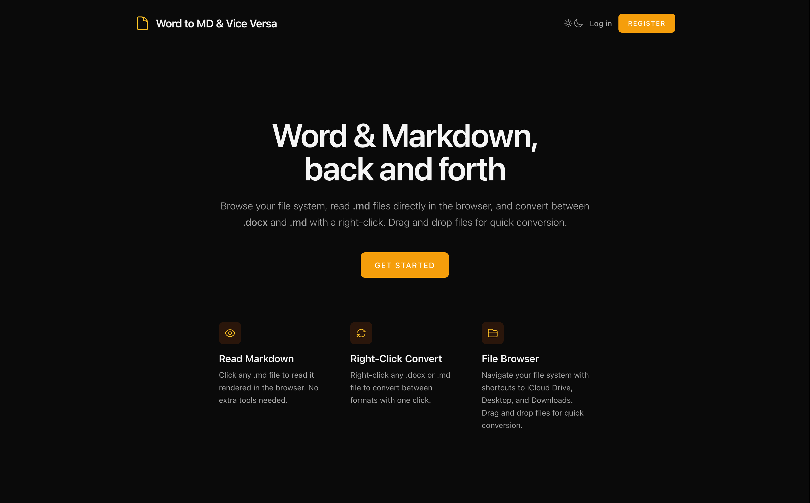
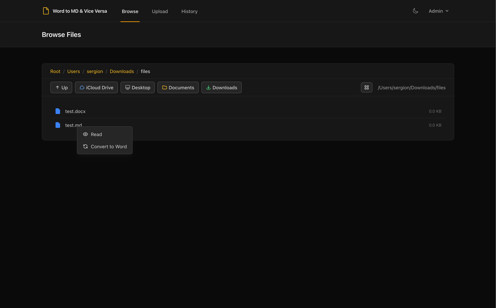
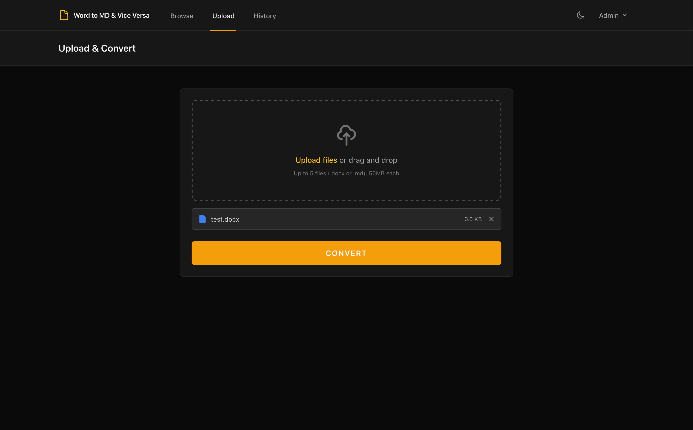

# Word to MD

A Laravel 12 web application for working with Word and Markdown files. Browse your local file system, read rendered Markdown directly in the browser, and convert bidirectionally between `.docx` and `.md` with a right-click. Drag and drop files for batch conversion.

### Homepage

The landing page gives you a quick overview of what the app does and a **Get Started** button to jump right in.



### File Browser

Navigate your file system with breadcrumb navigation and quick-access shortcuts to iCloud Drive, Desktop, Documents, and Downloads. Right-click any file to **Read** its rendered Markdown or **Convert** between `.docx` and `.md` in one click.



### Upload & Convert

Drag and drop up to 5 files (`.docx` or `.md`, 50 MB each) onto the upload area and hit **Convert** for batch conversion.



## Features

- **Markdown Reader** - Click any `.md` file to read it rendered with full formatting
- **Bidirectional Conversion** - Right-click to convert `.docx` to `.md` or `.md` to `.docx`
- **File Browser** - Navigate your file system with quick-access shortcuts (iCloud Drive, Desktop, Downloads)
- **Batch Upload** - Drag and drop up to 5 files at once for conversion
- **Dark / Light Theme** - Dark mode by default, toggle with the sun/moon icon
- **Admin Panel** - Filament-powered admin dashboard at `/admin`
- **Conversion History** - Track all past conversions

## Prerequisites

- **PHP** 8.2+
- **Composer**
- **Node.js** & **npm**
- **Pandoc** (must be available in your PATH)

### Installing Pandoc

```bash
# macOS
brew install pandoc

# Ubuntu/Debian
sudo apt-get install pandoc

# Windows (via Chocolatey)
choco install pandoc
```

## Setup

```bash
composer setup
```

This runs the following automatically:
1. Installs PHP dependencies
2. Copies `.env.example` to `.env` (if needed)
3. Generates the application key
4. Runs database migrations
5. Installs Node dependencies
6. Builds frontend assets

## Running the App

```bash
composer dev
```

This starts all services concurrently:

| Service | Description |
|---------|-------------|
| Server | `php artisan serve` (http://localhost:8000) |
| Queue | `php artisan queue:listen` |
| Logs | `php artisan pail` (real-time log viewer) |
| Vite | `npm run dev` (hot module replacement) |

## Running Tests

```bash
composer test
```

## Configuration

### File Browser Root

By default, the file browser can navigate the entire filesystem. To restrict it, set `BROWSE_ROOT` in your `.env`:

```
BROWSE_ROOT=/Users/yourname/Documents
```

### Admin Access

Run the seeder to create the default admin user:

```bash
php artisan db:seed
```

| Field | Value |
|-------|-------|
| Email | `admin@example.com` |
| Password | `test1234##` |

### Email

By default, mail is set to the `log` driver, meaning emails (password resets, etc.) are written to `storage/logs` instead of being sent. To enable real email delivery, update these variables in your `.env`:

```
MAIL_MAILER=smtp
MAIL_HOST=smtp.example.com
MAIL_PORT=587
MAIL_USERNAME=your-email@example.com
MAIL_PASSWORD=your-password
MAIL_ENCRYPTION=tls
MAIL_FROM_ADDRESS=noreply@example.com
MAIL_FROM_NAME="${APP_NAME}"
```

Any SMTP provider works (Mailgun, Postmark, SES, Mailtrap for testing, etc.). See the [Laravel Mail docs](https://laravel.com/docs/12.x/mail) for all supported drivers.

## Tech Stack

- **Laravel 12** - PHP framework
- **Livewire 3 + Volt** - Reactive frontend components
- **Alpine.js** - Lightweight JS framework (ships with Livewire)
- **Filament 4** - Admin panel
- **Tailwind CSS 3** - Utility-first styling
- **Vite 7** - Frontend build tool
- **Pandoc** - Document conversion engine (via `ueberdosis/pandoc`)
- **Pest** - Testing framework
- **SQLite** - Database (default)

## License

MIT
